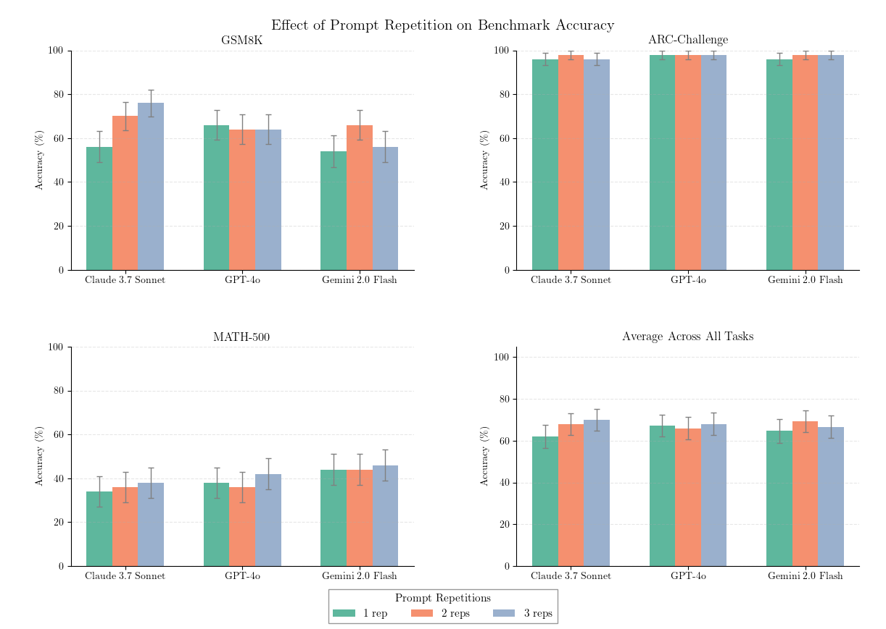

# Double Prompting in Non-Reasoning Models

This evaluation investigates the effectiveness of prompt repetition in 
improving the benchmark performance of non-reasoning models.

## Evaluation

Using inspect, three non-reasoning models are compared on the GSM8K, 
ARC Challenge, and MATH 500 Benchmarks. The models are evaluated in three conditions:
1. **(Baseline) Single Prompting**: The model is prompted once with the question.
2. **Double Prompting**: The model is prompted twice with the same question.
3. **Triple Prompting**: The model is prompted three times with the same question.

The prompts are composed of a baseline system prompt, followed by $n$ repetitions
of the instruction prompt, containing the evaluation question. The performance is measured in terms of accuracy 
on the respective benchmarks.

## Walkthrough

## Results

## References

This evaluation is based on the following paper:

Leviathan, Y., Kalman, M., & Matias, Y. (2025). *Prompt Repetition Improves Non-Reasoning LLMs*. arXiv:2512.14982. 
https://arxiv.org/abs/2512.14982
